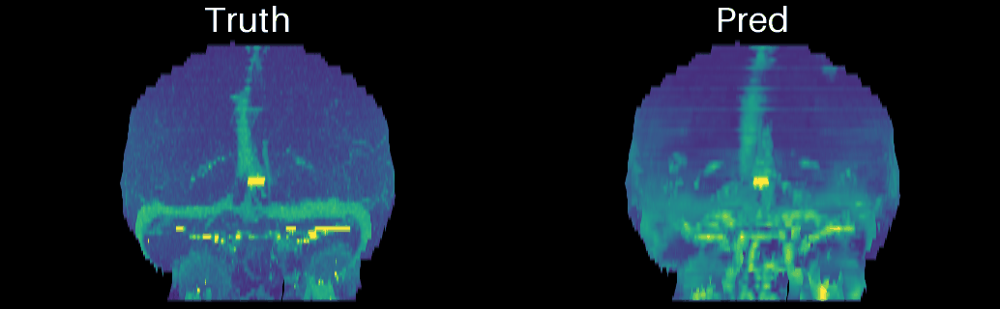
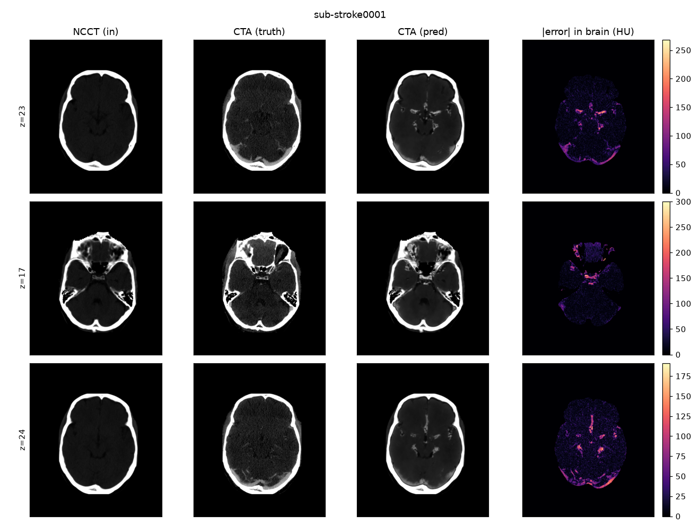
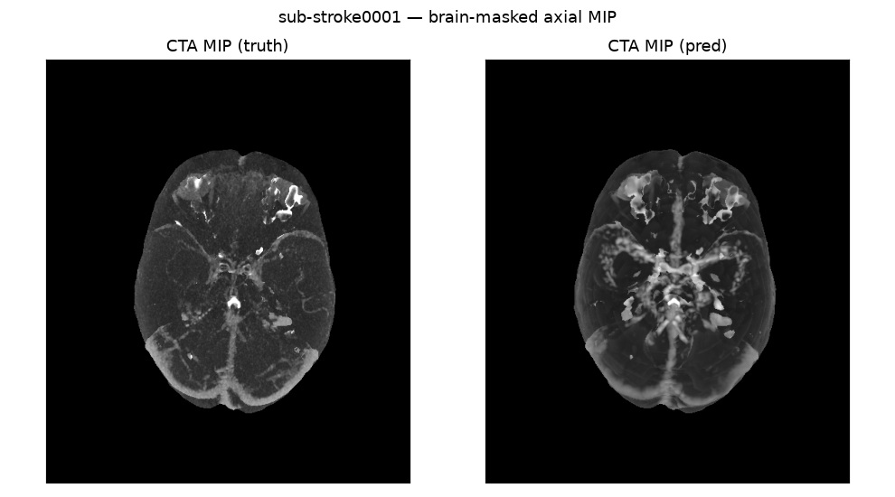

# NCCT → CTA synthesis (Aipek technical task, ISLES'24 data)



*Rotating brain-masked vessel MIP, ground truth (left) vs prediction (right) for sub-stroke0001.*

Predict a CT-angiography (CTA) volume from the paired non-contrast CT (NCCT) of the same
subject, voxel-wise on the shared grid, and emit predictions for the 15 fixed held-out
test subjects as HU `int16` NIfTI on the NCCT grid.

## TL;DR of the approach
* **Contrast-synthesis problem** NCCT and CTA differ almost
  only by intravascular iodine in arteries (a few percent of voxels); brain, bone, CSF and
  air are almost identical. Train a model to learns the **residual `CTA − NCCT`**, which is approx 0 except
  in vessels.
* **Set baselines: identity copy is the bar to beat.** It scores well on whole-volume metrics,
  so we report every metric **whole / brain / vessel** and always compare against the
  identity (and a global HU-remap) baseline.
* **Choice of model:** A U-net is the chosen architecture for the task. In this case we are using a MONAI vainilla U-net.
* **Loss matters:** MSE regresses to the mean and blurs vessels, so
  we use a **vessel-weighted L1** on the residual (possible extension: structural SSIM term,
  adversarial term, or even learnt similarity, cf. LSIM).
* **Finite-time conditioned problem and unobserved variables:** Some vessels that
  enhance in a normal CTA are occluded/dark here, and exact enhancement depends on bolus
  timing/collaterals invisible on NCCT. 
  Task is "impossible" because NCCT doesn't reveal occlusion. Model is expected to do well in
  the overall vessel tree (learning to "colour" vessels is better posed), it will do badly on occlusions
  (there is a vessel but no blood flow).

## Setup
```bash
conda env create -f environment.yml && conda activate aipek-ncct2cta
export ISLES_ROOT=/path/to/ISLES2024     # extracted BIDS root
```

## Pipeline (run from the project root, modules use `-m`)
```bash
# Check the data (pairs, shapes/affines, spacing, HU ranges, test-id presence)
python -m scripts.audit_data

# 1. Baselines (see below)
python -m src.baselines --method identity --out preds_identity
python -m src.baselines --method hu_remap --out preds_hu_remap

# 2. Train the residual model
#    local test (M1/MPS):
python -m src.train --config configs/local_test.yaml
#    full run (cloud CUDA GPU):
python -m src.train --config configs/unet3d_cloud.yaml --out artifacts/unet3d

# 3. Predict the 15 test subjects  -> preds/  (HU, int16, NCCT grid)
python -m src.infer --ckpt artifacts/unet3d/best.pt --out preds

# 4. Verify output format, evaluate, visualize
python -m scripts.verify_preds --preds preds
python -m src.evaluate --pred identity=preds_identity --pred hu_remap=preds_hu_remap --pred unet=preds
python -m src.viz --preds preds --out artifacts/figures
python -m src.viz3d --sid sid --pred preds
```

## Full workflow (prototype local → train cloud)
1. Test the whole pipeline locally (my case on a Macbook Pro M1) with `configs/local_test.yaml`.
2. `python -m scripts.subset_for_cloud --out /data/ISLES2024_subset` copies only NCCT+CTA
   (a few GB) for upload.
3. On the GPU: `export ISLES_ROOT=/data/ISLES2024_subset` and run
   `configs/unet3d_cloud.yaml`.
4. Pull back `best.pt`, run inference + evaluation locally.

## Layout
```
src/        baselines, brain_mask, constants, data, evaluate, infer, losses, model, train, viz, viz3d
scripts/    audit_data, plot_training, precompute_brain_masks, subset_for_cloud, verify_preds
configs/    local_test, unet3d_cloud
preds/      final 15 predictions 
```

## Design choices with brief explanation
| Choice | Why |
|---|---|
| Residual target `CTA−NCCT` | Identity for free; capacity focuses on vascular contrast |
| Native anisotropic spacing, anisotropic patches | Real data is ~0.2 mm in-plane vs ~4 mm through-plane; isotropic resampling would distort |
| Vessel-weighted L1 norm | Sharper vessels: avoids mean-regression blur. Background is a large part of the data, but less relevant |
| Brain mask | The ISLES'24 winners (Ren et al., arXiv 2505.18424) credit SynthStrip + windowing; brain mask weights the loss, restricts synthesis to the brain, and gives clean brain/vessel metrics. In this case, rough mask insted of SynthStrip |
| Multi-window NCCT input | Inspired by the winners' per-modality clinical-windowing, adding more information as input channels for the model. |
| Residual added back to true raw NCCT | Outside the synthesized brain region the output is exactly the original HU (air/bone/skull preserved), not window-clipped |

## Evaluation and results
Report MAE (HU), RMSE, PSNR, and SSIM, each in **whole / brain / vessel**
regions, for every model alongside to the identity and HU-remap baselines. A model only
"works" if it beats identity inside vessels while not degrading elsewhere. Figures show
representative slices, error maps, and axial MIPs. Failure-case is expected on occluded territories.

Metrics averaged over all test subjects (mean ± std). Lower is better for MAE/RMSE; higher is better for PSNR/SSIM.

| Method    | MAE (whole)     | MAE (brain)     | MAE (vessel)      | RMSE (vessel)     | PSNR (brain)    | SSIM            |
|-----------|-----------------|-----------------|-------------------|-------------------|-----------------|-----------------|
| identity  | 51.44 ± 31.53   | 25.28 ± 12.01   | 179.64 ± 31.41    | 196.29 ± 48.06    | 26.63 ± 1.89    | 0.875 ± 0.039   |
| hu_remap  | 54.68 ± 28.18   | 20.86 ± 11.35   | 177.93 ± 29.69    | 194.75 ± 47.25    | 27.50 ± 1.87    | 0.870 ± 0.036   |
| **unet**  | **50.28 ± 31.26** | **18.47 ± 11.33** | **89.43 ± 36.09** | **115.97 ± 55.85** | **28.20 ± 1.86** | 0.873 ± 0.039   |

**Baselines:** `identity` copies the input NCCT unchanged; `hu_remap` applies a fixed HU intensity remap.

The **U-Net** gives the best whole-image and brain MAE, the highest brain PSNR, and roughly halves vessel error (MAE and RMSE) versus both baselines. Largest gains are in the vessel region, guided by the loss. SSIM is essentially tied across all three methods.

## Example figures (sub-stroke0001)



*Representative axial slices: NCCT input, ground-truth CTA, predicted CTA, and per-slice absolute error (restricted to the brain).*



*Brain-masked axial maximum-intensity projection: ground truth (left) vs prediction (right).*

